```{r setup, include=FALSE, message=FALSE, warning=FALSE}
options(htmltools.dir.version = FALSE, fig.retina = 3, warning = FALSE, message = FALSE)
```

class: title-slide, center, middle

## A Reproducible Workflow
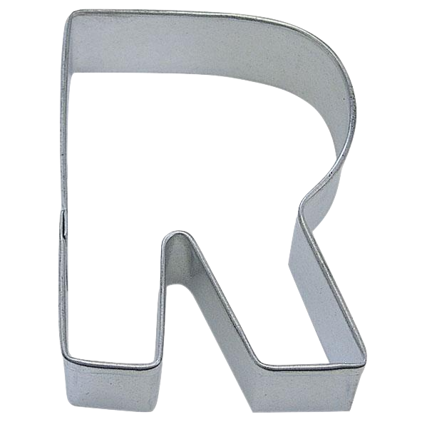
### using R and GitHub
.large[Henry Partridge | BRITE event | 3 July 2019]

<br /><br /><a rel="license" href="http://creativecommons.org/licenses/by-nc/4.0/"></a>

---

layout: true

---

class: center, middle
## Who am I?


I'm the manager of the <a href="https://www.trafforddatalab.io/" target="_blank">Trafford Data Lab</a>. I have an academic background in German philosophy and crime science. I've previously worked at TfL and MMU. I've been a cheerleader for <a href="https://twitter.com/hashtag/rstats" target="_blank">#rstats</a> since 2013.

---

class: center, middle

# What is reproducibility?

---

## &nbsp;

<h4>reproducibility <span style = "color:#757575;font-size:16px;font-weight:normal;">/ˌriːprəˌdjuːsəˈbɪlɪti/ <em>noun</em> to obtain the same results using the method and data of the original study</span></h4>

--

<br/>
*which is different from ...*
<br/><br/>

--

<h4>replication <span style = "color:#757575;font-size:16px;font-weight:normal;">/rɛplɪˈkeɪʃ(ə)n/ <em>noun</em> to obtain the same results using the method of the original study and <span style = "text-decoration: underline;">independently collected data</span></h4>

---

class: center, middle

## Why is reproducibility important?

---

class: left, middle

<h2><i class="fa fa-quote-left fa-fw" aria-hidden="true"></i>non-reproducible single occurrences are of no significance to science<i class="fa fa-quote-right fa-fw" aria-hidden="true"></i></h2>
<h5> Karl Popper, The Logic of Scientific Discovery</h5>

---

## Why is reproducibility important?

- allows checking and double checking by yourself and others
- enables rigorous peer review
- gives confidence in results

---

## "Reproducibility crisis"

.pull-left[
<figure>
  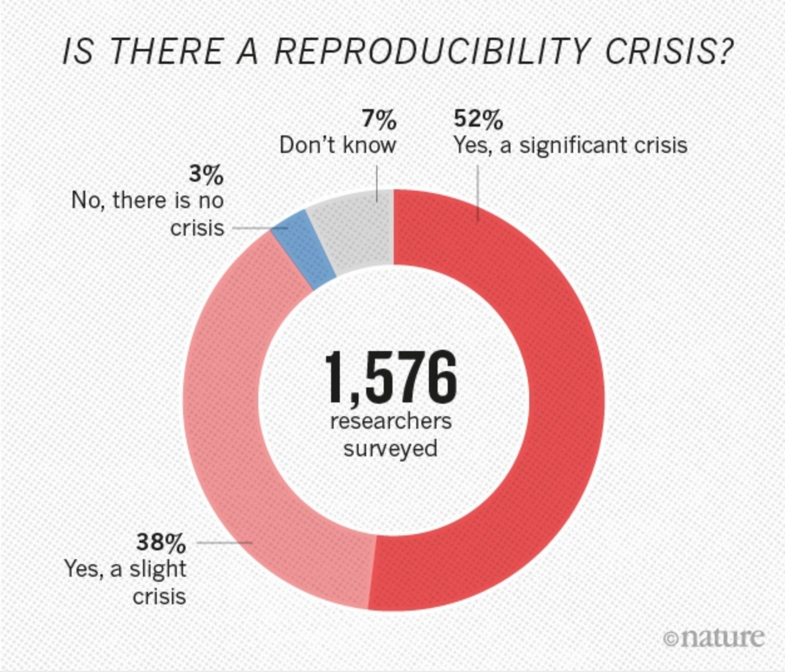
  <figcaption style="font-size:10pt;">Source: <a href="https://www.nature.com/news/1.19970" target="_blank">nature.com</a></figcaption>
</figure> 
]
--
.pull-right[
100 experimental and correlational studies in psychology were repeated with larger sample sizes. 97% of the original studies had statistically significant results but only 36% of the replications did. The replication effects were on average half the magnitude of the mean effect size of the original effects.
<p style="font-size:10pt;">Open Science Collaboration. (2015). Estimating the reproducibility of psychological science. Science, 349(6251), aac4716, <a href="https://doi.org/10.1126/science.aac4716" target="_blank">DOI:10.1126/science.aac4716</a></p>
]

---

## Open science initiatives
- <a href="https://cos.io/rr/" target="_blank">Registered Reports</a>
- study <a href="https://osf.io/e6auq/wiki/Example%20Preregistrations/?view" target="_blank">pre-registrations</a>
- many-lab replication projects e.g <a href="https://osf.io/wx7ck/" target="_blank">ManyLabs</a>
- sharing data
- open access publishing

---

class: left, middle

<h3><i class="fa fa-quote-left fa-fw" aria-hidden="true"></i>Reproducibility has the potential to serve as a minimum standard for judging scientific claims when full independent replication of a study is not possible.<i class="fa fa-quote-right fa-fw" aria-hidden="true"></i></h3>
<p style="font-size:10pt;">Peng, R. D. (2011). Reproducible research in computational science. Science, 334(6060), 1226-1227, <a href="https://doi.org/10.1126/science.1213847" target="_blank">DOI:10.1126/science.1213847</a></p>

---

class: center, middle

# Practical steps for a reproducible workflow

---

## Organised projects

- make your project folder self-contained
- quarantine your raw data

```{r, eval=FALSE}
└── project
    ├── data
    │   ├── raw         # read-only pre-processed datasets
    │   └── processed   # intermediate datasets
    ├── R               # R scripts
    ├── outputs         # tables, charts
    ├── README.md       # project description
    ├── LICENCE.txt     
    └── .gitignore      
```

---

## Readable code

- avoid absolute paths
- adopt a consistent style
- comment your code
- write functions

```{r, eval=FALSE}
# this an absolute path
df <- read.csv("/Users/henrypartridge/Documents/project/data/foo.csv", stringsAsFactors = FALSE)

# this is a relative path
df <- read.csv("data/foo.csv", stringsAsFactors = FALSE)
```

---

## Literate programming

- avoid word processing software like MS Word
- combine code with human-readable plain text in <a href="https://rmarkdown.rstudio.com/" target="_blank">R Markdown</a>

.pull-left[
*R Markdown*
<pre lang="no-highlight"><code>Bolton Science and Technology Centre
is located on Minerva Road.<br/><br/>```{r out.width = '100%', 
fig.height = 3, echo = FALSE}
leaflet() %>% 
  addTiles() %>% 
  addMarkers(-2.424208, 53.554980,
             popup = "Bolton Science 
             and Technology Centre")
```</code></pre>
]

.pull-right[
*HTML output*   
<br/>
Bolton Science and Technology Centre is located on Minerva Road.
```{r out.width = '100%', fig.height = 3, echo = FALSE}
library(leaflet)
leaflet() %>% 
  addTiles() %>% 
  addMarkers(-2.424208, 53.554980,
             popup = "Bolton Science 
             and Technology Centre")
```
]

---

## Version control

- tracks changes to code and plain text files without need for version v0.1 etc.
- timestamps your work
- encourages collaboration
- integrates with <a href="https://www.rstudio.com/" target="_blank">RStudio</a>
- remote copies of local projects can be stored on GitHub which also provides issue tracking, wikis and website hosting

<br/>

.center[
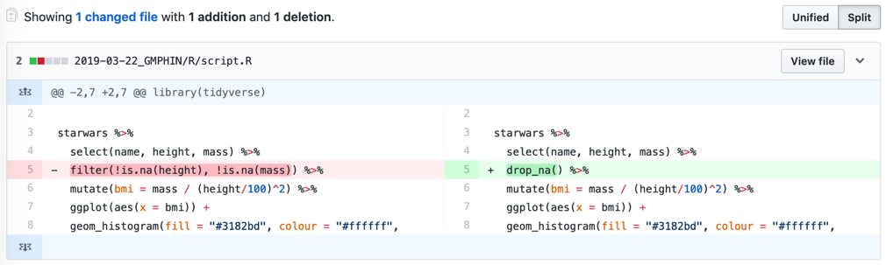 
]

---

## Licensing
Give people permission to use your data and code:

- <a href="http://www.nationalarchives.gov.uk/doc/open-government-licence/version/3/" target="_blank">Open Government Licence 3.0</a> for government published data
- <a href="https://creativecommons.org/share-your-work/" target="_blank">CC-BY</a>  (Creative Commons Attribution) for media and text
- <a href="https://opensource.org/licenses/MIT" target="_blank">MIT</a>  licence for code

---

class: center, middle

# The Lab's workflow

---

class: center, middle

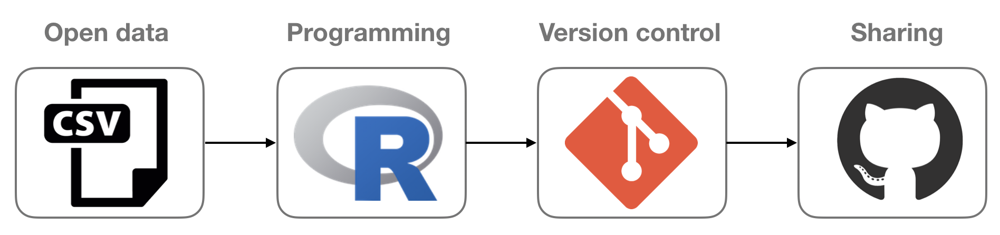 

---

## Example #1

.pull-left[
<a href="https://www.trafforddatalab.io/ward_profiler/?theme=Health&name=Hospital%20admissions%20for%20self-harm">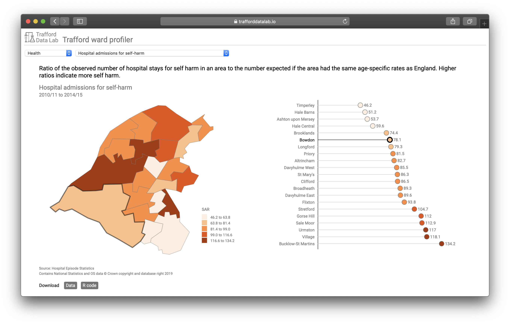</a>
]
.pull-right[
<a href="https://github.com/traffordDataLab/ward_data">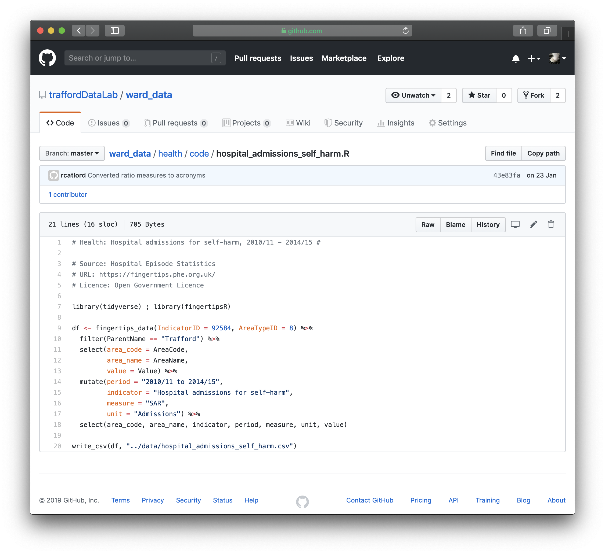</a>
]

---


## Example #2

.pull-left[
<a href="https://trafforddatalab.shinyapps.io/dashboard/">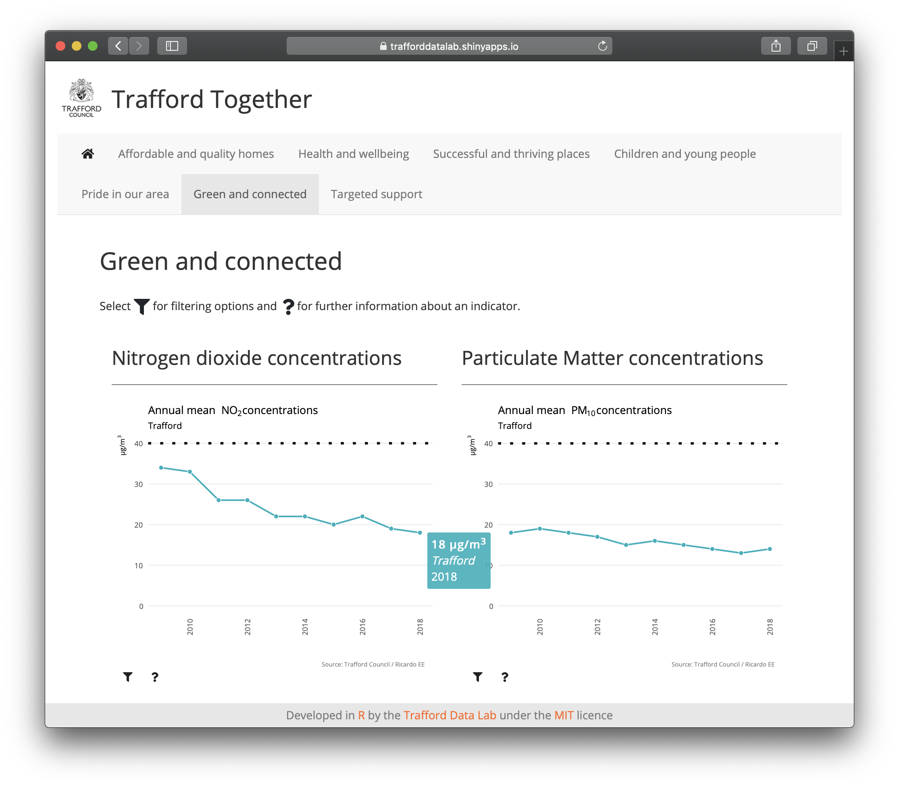</a>
]

.pull-right[
<a href="https://github.com/traffordDataLab/dashboard">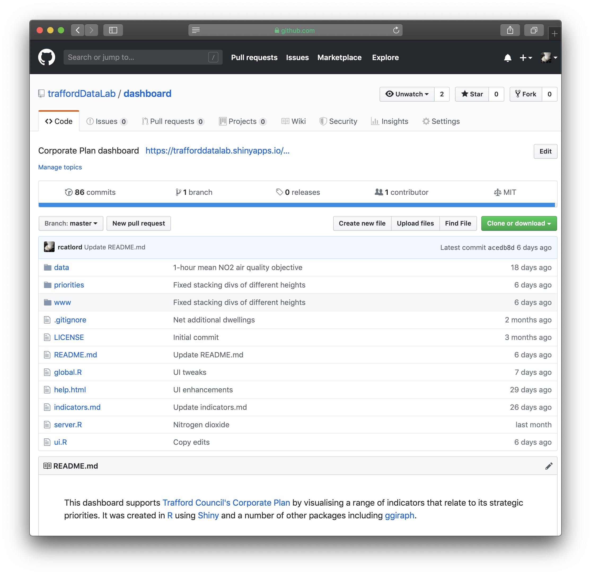</a>
]


---

## Example #3

.pull-left[
<a href="https://www.trafforddatalab.io/recipes">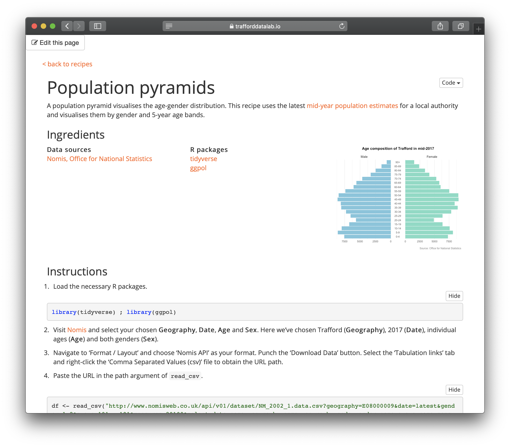</a>
]

.pull-right[
<a href="https://twitter.com/AppliedInfoNott/status/1139815496335933440">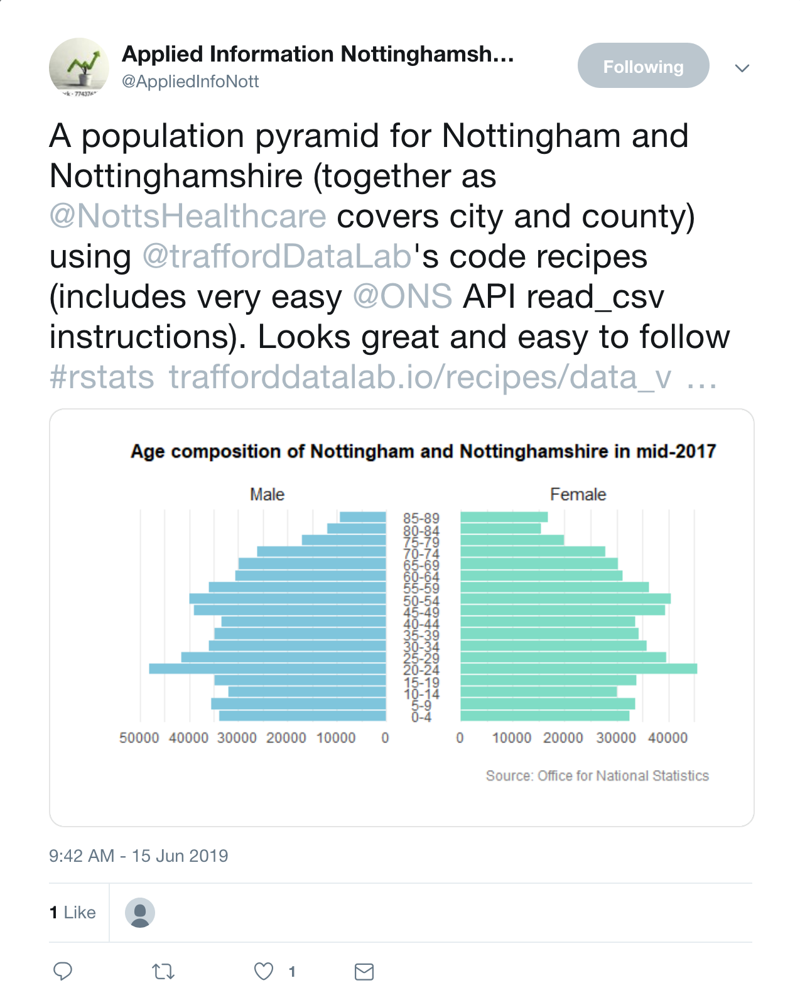</a>
]

---

class: center, middle

## take-home message

---

class: center, middle

<figure>
  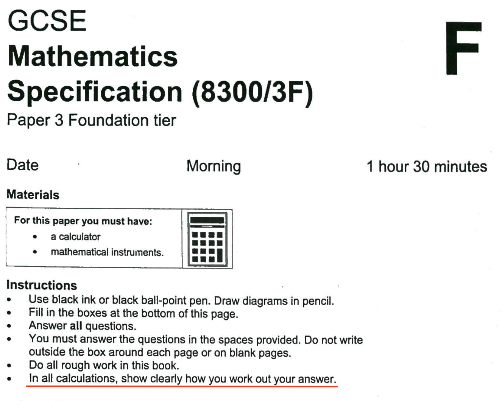
  <figcaption style="font-size:10pt;">Source: <a href="https://www.aqa.org.uk/" target="_blank">AQA</a></figcaption>
</figure> 

---

## Useful resources

<ul>
  <li>Broman, K. W., & Woo, K. H. (2018). Data organization in spreadsheets. The American Statistician, 72(1), 2-10, <a href="https://doi.org/10.1080/00031305.2017.1375989" target="_blank">DOI:10.1080/00031305.2017.1375989</a></li>
  <li>Bryan, J. (2018). <a href=“https://happygitwithr.com/” target=“_blank”>Happy Git and GitHub for the useR</a></li>
  <li>Bryan, J. (2017) <a href=“https://www.tidyverse.org/articles/2017/12/workflow-vs-script/” target=“_blank”>Project-oriented workflow</a></li>
  <li>rOpenSci, <a href=“http://ropensci.github.io/reproducibility-guide/” target=“_blank”>Reproducibility in Science</a></li>
</ul>

---

class: right, middle

# thank you

<a href="http://twitter.com/trafforddatalab"><i class="fa fa-twitter fa-fw"></i>@trafforddatalab</a><br>
<a href="http://github.com/trafforddatalab"><i class="fa fa-github fa-fw"></i>@trafforddatalab</a><br>
<a href="https://www.trafforddatalab.io"><i class="fa fa-link fa-fw"></i>trafforddatalab.io</a><br>

Slides created with [**remark.js**](http://remarkjs.com/) and the R package [**xaringan**](https://github.com/yihui/xaringan)